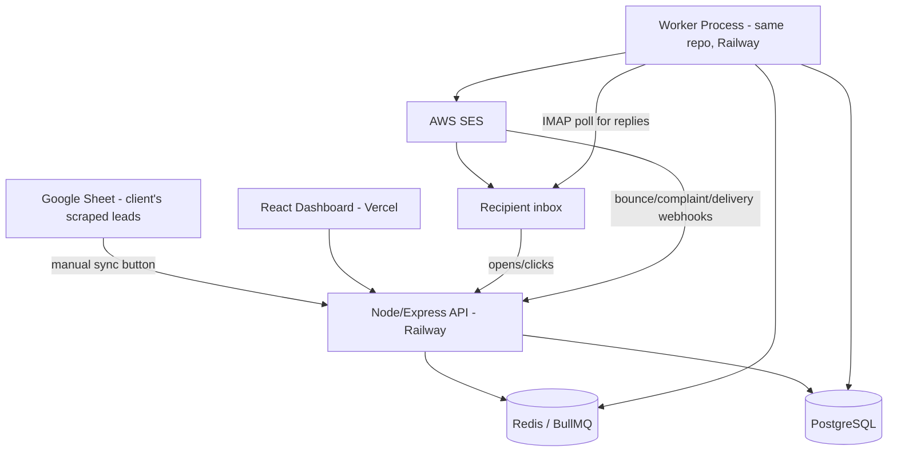
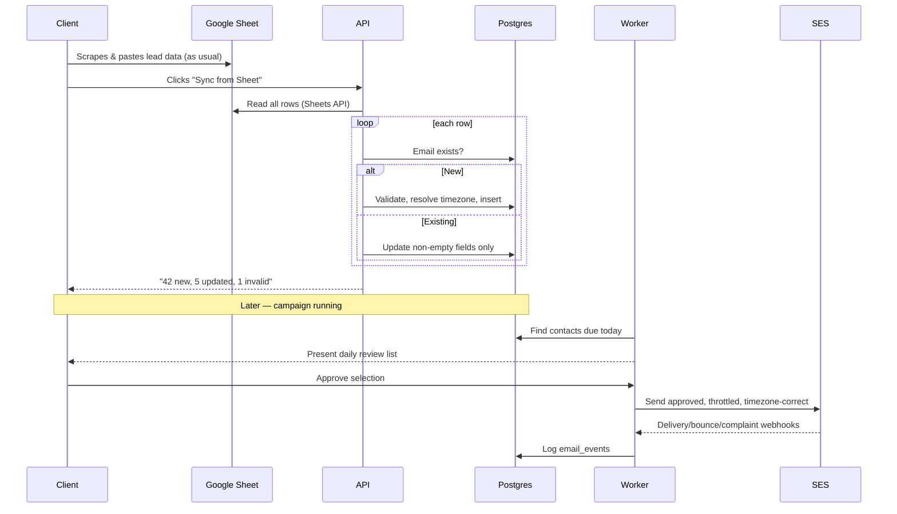

# Email Outreach Automation Platform — Simplified Build
## Single-Client Version — SRS, Architecture & Roadmap (v2)

**Scope:** A lightweight, single-client cold email automation tool. Client scrapes leads into Google Sheets as he already does; the system syncs that into a real database, runs personalized multi-step email sequences on autopilot (timezone-aware, throttled, trackable), and gives the client a daily approval screen before anything sends.

This document replaces the earlier enterprise/multi-tenant SaaS version. Nothing here assumes multiple clients, roles, or massive scale — it's sized for one business's real daily volume (tens to low hundreds of emails/day).

---

## Table of Contents
1. Requirements Summary
2. Final Tech Stack
3. System Architecture (Simplified)
4. Data Flow: Google Sheets → Postgres → Sending
5. Database Design
6. Core Workflows
7. Timezone Handling
8. Email Tracking & Reply Detection
9. AWS SES Integration Summary
10. Hosting & Deployment
11. Security (Right-Sized)
12. Phased Roadmap
13. What Was Deliberately Left Out

---

## 1. Requirements Summary

**Contact data**
- Client scrapes leads (name, company, email, phone, domain, location, industry, etc.) and enters them into Google Sheets — his existing habit, unchanged.
- App pulls from the Sheet via the Google Sheets API, on a **manual "Sync from Sheet" button click** (not automatic polling).
- New emails → inserted as new contacts. Existing emails → updated with any non-empty fields from the Sheet (blank cells never overwrite existing data). Campaign/send history is never touched by a contact sync.
- Sync shows a result summary: new / updated / skipped / invalid.

**Templates & Sequences**
- Multiple reusable templates (Intro, Follow-up 1–4, etc.) with merge tags: `{{name}}`, `{{company}}`, `{{location}}`, `{{industry}}`, plus custom fields.
- Sequences: ordered steps, each a template + a delay (e.g., Day 0, Day 2, Day 4, Day 6, Day 7), fully configurable.

**Sending rules**
- Daily send cap (e.g., 100/day).
- Gradual/throttled sending across the day, not a burst.
- Business-hours-only sending, weekends on/off toggle.
- Sends occur at the **recipient's local time**, resolved from their location.

**Daily review checkpoint**
- Each day, the system builds a list of "due to send today" contacts.
- Client opens the dashboard, sees the list (pre-checked/opt-out style), deselects anyone he doesn't want mailed that day, and approves.
- Only approved items actually get sent; nothing goes out without this step.
- Event-triggered automations (e.g., "opened → wait 2h → send") bypass this daily review, since they're reactive, not part of the daily batch.

**Tracking**
- Status per email: Queued → Sending → Sent → Delivered → Opened → Clicked → Replied / Bounced / Failed / Unsubscribed / Spam Complaint.
- Tracking pixel for opens, wrapped links for clicks, SES webhooks for delivered/bounced/complaints, IMAP polling for replies.

**Reply handling**
- Auto-reply (OOO) detected → sequence continues as scheduled.
- Genuine reply detected → sequence stops for that contact immediately.

**Dashboard**
- Basic analytics: total contacts, campaigns, sent, delivered, open rate, reply rate, bounce rate, active/completed campaigns, daily graph, funnel view, per-contact timeline.

**Security (right-sized)**
- Single login (client + maybe one teammate).
- SES/Google API credentials stored as encrypted environment variables, never in code or the database in plaintext.
- Basic rate limiting on the login endpoint.

---

## 2. Final Tech Stack

| Layer | Choice | Why |
|---|---|---|
| Contact source | Google Sheets (existing) + Google Sheets API | Zero workflow change for the client |
| Backend | Node.js + Express | Simple, widely documented, matches the queue library choice |
| Language | TypeScript (recommended) | Autocomplete + error-catching across ~10 interconnected tables, worth it even for a solo build |
| ORM | Prisma | Beginner-friendly, no raw SQL needed, auto-generates types |
| Database | PostgreSQL (managed — Supabase, Railway, Neon, or Render) | Real relational integrity, safe concurrent writes, no spreadsheet-style race conditions |
| Queue / Scheduling | BullMQ + Redis | Native delayed jobs (perfect for "send in N days"), throttling, retries |
| Sending | AWS SES | Cheapest at this scale (~$0.10/1,000 emails), reliable webhooks for bounce/complaint/delivery |
| Backend hosting | Railway | No server admin needed, one-click Postgres/Redis, git-push deploys |
| Frontend | React | Simple dashboard: contacts, campaigns, daily review, analytics |
| Frontend hosting | Vercel | Purpose-built for React, free tier, auto HTTPS, zero-config deploys |

**Deliberately not used:** NestJS, microservices split, Kubernetes, RabbitMQ, multi-tenant workspace isolation, RBAC roles beyond a single login, read replicas, ClickHouse/Kafka, dedicated IP pools, sender warm-up automation (can be added later if volume grows significantly).

---

## 3. System Architecture (Simplified)



**Two processes, one codebase:**
- **API/Web process** — serves the React dashboard's requests: contacts, campaigns, templates, the daily review screen, analytics, the Sheets sync trigger.
- **Worker process** — runs on a schedule (via BullMQ), does the actual work: builds the daily due-list, sends approved emails through SES (throttled, timezone-aware), polls IMAP for replies, processes SES webhook events.

Both run as two small services within the same Railway project, sharing the same Postgres and Redis instances.

---

## 4. Data Flow: Google Sheets → Postgres → Sending



---

## 5. Database Design

Core tables (no multi-tenant scoping needed — single client):

- **contacts** — id, name, company, phone, domain, location_raw, resolved_timezone, industry, email (unique), custom_fields (JSONB), is_suppressed, source_row_ref, created_at, updated_at
- **contact_lists** / **contact_list_members** — grouping contacts for campaigns
- **templates** — id, name, subject, body_html, body_text, created_at
- **campaigns** — id, name, status, sending_rules (JSONB: daily_limit, business_hours, weekends_enabled), created_at
- **sequence_steps** — id, campaign_id, step_order, template_id, delay_days, delay_hours
- **campaign_contacts** — id, campaign_id, contact_id, current_step_id, state, enrolled_at
- **daily_send_queue** — id, campaign_contact_id, sequence_step_id, target_date, status (pending_review/approved/excluded/dispatched)
- **email_sends** — id, campaign_contact_id, sequence_step_id, scheduled_for, current_status, provider_message_id, attempt_count — unique on (campaign_id, contact_id, sequence_step_id)
- **email_events** — id, email_send_id, event_type, event_data (JSONB), occurred_at — append-only
- **automation_triggers** / **automation_trigger_log** — for open/click/reply-triggered follow-ups
- **suppression_list** — id, email, reason, added_at

Same relational logic as the original design — just without `workspace_id` scoping on every table, since there's one client.

---

## 6. Core Workflows

**A. Weekly/Daily Use**
1. Client scrapes leads throughout the day/week into the Sheet.
2. Client clicks "Sync from Sheet" whenever ready → new/updated contacts land in Postgres.
3. Client builds or reuses a campaign (contact list + template sequence + sending rules).
4. Each day, the Worker computes who's due → populates the daily review queue.
5. Client opens the dashboard, reviews the pre-checked list, deselects any companies he doesn't want mailed today, clicks Approve.
6. Worker sends approved emails throughout the day, throttled, at each recipient's local business hours.
7. Tracking/webhooks update statuses in real time; replies stop the sequence for that contact automatically.

**B. Reactive Automation (bypasses daily review)**
- Example: contact opens an email → wait 2 hours → automatically send a specific follow-up, without waiting for the next day's manual approval.

---

## 7. Timezone Handling

- At contact creation/sync, `location_raw` (e.g., "Austin, TX" or "London") is resolved to an IANA timezone (e.g., `America/Chicago`, `Europe/London`) and stored on the contact — using a timezone-boundary lookup, done once at import time, not per-send.
- When scheduling a send, "10 AM" is computed **in the contact's local timezone** using a timezone-aware date library (never manual UTC offset math — this breaks across DST changes), then converted to a UTC instant for the BullMQ delayed job.
- Business-hours and weekend rules are evaluated against the contact's local calendar day, not the sender's.

---

## 8. Email Tracking & Reply Detection

- **Opens:** 1x1 tracking pixel with a signed token embedded in each sent email.
- **Clicks:** links rewritten to a redirect endpoint that logs the click, then forwards to the real URL.
- **Delivered/Bounced/Spam Complaint:** AWS SES event notifications (via SNS) hit a webhook endpoint in your API, which logs the event and updates status.
- **Replies:** since sending goes through SES (not the client's personal inbox), reply detection uses **IMAP polling** of the client's connected reply-to mailbox — checks periodically for new mail, matches it to the original send via `Message-ID`/`In-Reply-To` headers.
- **Auto-reply vs. genuine reply:** checked via `Auto-Submitted` headers first, then subject/body pattern matching (Out of Office, Automatic Reply, etc.) as a fallback. Auto-replies don't stop the sequence; genuine replies do.

---

## 9. AWS SES Integration Summary

1. Create AWS account → open SES console, pick a region.
2. Verify the client's sending domain (DNS: SPF, DKIM records provided by SES).
3. Add DMARC record.
4. Request production access (exits the 200/day sandbox limit).
5. Create an IAM user scoped to SES-only permissions; generate access keys for the app.
6. Backend calls SES via the AWS SDK (`SendEmail`) from the Worker process — this is the only part of the app that talks to AWS directly.
7. Connect SES bounce/complaint/delivery notifications to an SNS topic, pointed at a webhook endpoint in your API.

At 100 emails/day, this comfortably runs within SES's cheapest tier — cost is a non-issue at this volume.

---

## 10. Hosting & Deployment

| What | Where | Notes |
|---|---|---|
| React dashboard | Vercel | Connect GitHub repo, auto-deploys on push, free tier sufficient |
| API + Worker | Railway | Two services from the same repo; git-push deploys |
| PostgreSQL | Railway (or Supabase) add-on | Managed, automatic backups |
| Redis | Railway add-on | Backs BullMQ |
| Sending | AWS SES | Only AWS service used; scoped IAM credentials |
| Domain | Client's existing domain | DNS records for SPF/DKIM/DMARC + pointing the dashboard subdomain (e.g., `app.clientdomain.com`) at Vercel |

Environment variables (SES keys, Google Sheets API credentials, database URL) are set in Railway/Vercel's dashboard — never committed to code.

---

## 11. Security (Right-Sized)

- Single login (email + password, hashed with bcrypt); a second login for a teammate if needed — no complex role system required.
- All credentials (SES, Google Sheets API, IMAP) stored as encrypted environment variables via the hosting platform's secret management — not in the database, not in code.
- Basic rate limiting on the login endpoint to prevent brute-force attempts.
- HTTPS everywhere (automatic via Vercel/Railway).
- Unsubscribe link in every template, honored via the suppression list, checked before every send (legal requirement, not optional).

---

## 12. Phased Roadmap

**Phase 1 (Week 1–2) — Foundations**
- Set up Railway project, Postgres, Redis, Vercel frontend shell.
- Define Prisma schema for core tables.
- Basic login.

**Phase 2 (Week 2–3) — Contacts & Sheets Sync**
- Google Sheets API connection, manual sync button, column mapping, validation, dedup/update logic.
- Timezone resolution on import.

**Phase 3 (Week 3–5) — Templates & Campaigns**
- Template CRUD + merge-tag rendering.
- Campaign + sequence step builder.
- Sending rules configuration (daily cap, business hours, weekends).

**Phase 4 (Week 5–6) — Sending Engine**
- AWS SES setup (domain verification, production access).
- BullMQ integration: delayed jobs, throttling, daily cap enforcement.
- Daily review queue: build list, approve/exclude UI, dispatch approved sends.
- **Milestone: first real automated campaign sent end-to-end.**

**Phase 5 (Week 6–7) — Tracking & Replies**
- Tracking pixel + click redirect.
- SES webhook (SNS) ingestion for delivered/bounced/complaint.
- IMAP polling + reply classification (auto-reply vs. genuine vs. bounce).

**Phase 6 (Week 7–8) — Automation & Analytics**
- Event-triggered follow-ups (open → wait → send).
- Dashboard: KPIs, daily graph, funnel, contact timeline.

**Phase 7 (Week 8) — Polish & Launch**
- Unsubscribe flow, suppression list enforcement.
- Domain DNS finalization (SPF/DKIM/DMARC).
- Client walkthrough, first real production week.

**Total: ~8 weeks**, solo or small-team pace — roughly half the original enterprise-scale estimate, reflecting everything cut in §13.

---

## 13. Operational Details

### 13.1 Campaign Lifecycle
```
Draft → Scheduled → Active → (Paused ⇄ Active) → Completed → Archived
```
- **Draft:** being built, no contacts enrolled. **Scheduled:** launch confirmed, start date in future. **Active:** enrolling/sending, appears in daily review. **Paused:** no new sends, sequence position preserved exactly. **Completed:** every enrolled contact has finished (sent all steps, replied, bounced, or unsubscribed). **Archived:** hidden from active view, data retained.

### 13.2 Worker Responsibilities
The Worker process owns everything time-based or external-facing: builds the daily due-list, populates `daily_send_queue`, dispatches approved sends (render template → check cap/suppression → call SES → log event), consumes SES webhooks, polls IMAP and classifies replies, evaluates automation triggers, runs the nightly analytics rollup. The API process only serves the dashboard and enqueues jobs — it never talks to SES/IMAP/Sheets directly on a schedule.

### 13.3 Scheduler Logic
A daily cron (e.g., 6 AM) finds `campaign_contacts` due today (delay elapsed, not yet sent this step, not suppressed/replied/bounced, campaign Active) and inserts them into `daily_send_queue` as `pending_review`. A safety-net sweep every ~15 minutes catches anything missed by a single cron tick or worker restart, making the system self-healing. Once approved, each row gets a BullMQ delayed job for its exact timezone-resolved, business-hours-respecting send time.

### 13.4 Retry Policy
| Failure | Behavior |
|---|---|
| Transient SES error | Exponential backoff, up to 3 attempts |
| Permanent SES rejection | No retry — mark `failed` |
| Hard bounce | No retry — mark `bounced`, suppress immediately |
| Soft bounce | Retry once after a delay; second soft bounce → `failed`, flagged for review |
| Sheets sync failure | No auto-retry — client re-clicks Sync, error shown |
| IMAP poll failure | Retried on next scheduled poll |

### 13.5 Failure Recovery
Worker crashes mid-send → BullMQ retains the job until success, idempotency check (§13.7) prevents duplicate sends on resume. Railway restarts → no data loss, all state lives in Postgres/Redis, not memory. SES outage → failed jobs logged with reason, visible in dashboard, manually re-triggerable.

### 13.6 Suppression Rules
Added to `suppression_list` (checked before every send) on: unsubscribe click, hard bounce, repeated soft bounces (e.g., 3+), spam complaint, or manual client addition. Suppression is global and permanent by default — re-syncing a suppressed contact from the Sheet does not re-enroll them; un-suppressing requires an explicit manual dashboard action.

### 13.7 Queue / Job Lifecycle
```
Created → Waiting → Active → Completed
                        ↓
                     Failed → Retry (per §13.4) → Completed or Failed (final)
```
Each job type (send-email, sync-sheet, poll-imap, analytics-rollup) is its own queue so one type's failures never block another. Idempotency is enforced via a unique constraint on `(campaign_id, contact_id, sequence_step_id)` in `email_sends`, so a retried/duplicated job is a safe no-op if a send already exists.

### 13.8 Contact and Email State Transitions
**Per-contact campaign state:** `Pending → Scheduled → Sent-Step-N → (repeat) → Completed`, with early exits to `Replied → Stopped`, `Bounced → Suppressed → Stopped`, or `Unsubscribed → Suppressed → Stopped`.
**Per-email state:** `Queued → Sending → Sent → Delivered → Opened → Clicked`, with branches to `Bounced` or `Failed`. These are tracked independently — email-level events feed analytics/timeline; contact-level state drives whether the next sequence step is scheduled.

### 13.9 Import Validation (Sheets Sync)
Each synced row: required-field check (email) → syntax validation → MX record check → duplicate match (case-insensitive email) → suppression check (flagged, not re-enrolled) → name-presence check (`needs_review` if missing, per earlier decision) → timezone resolution (flagged if unresolvable). Every sync returns a report: New / Updated / Skipped (duplicate) / Invalid (bad email/MX) / Needs Review.

### 13.10 Logging Strategy
Two separate logs by design: **business event log** (`email_events`, `audit_logs` in Postgres — dashboard-visible, permanent, e.g. campaign created, mail sent, reply received) and **system/application logs** (Railway's built-in log viewer — errors, stack traces, job failures, for debugging only). At this scale, Railway's native log tailing is sufficient; no dedicated logging service needed.

### 13.11 Configuration
Environment variables (never hardcoded): `DATABASE_URL`, `REDIS_URL`, `AWS_ACCESS_KEY_ID`/`AWS_SECRET_ACCESS_KEY`/`AWS_REGION`/`SES_FROM_ADDRESS`, `GOOGLE_SHEETS_API_KEY`/`SHEET_ID`, `IMAP_HOST`/`IMAP_USER`/`IMAP_PASSWORD` (encrypted), `JWT_SECRET`, plus app-level defaults (`DEFAULT_DAILY_SEND_CAP`, `DEFAULT_BUSINESS_HOURS_START/END`, `DEFAULT_TIMEZONE_FALLBACK`). Per-campaign settings (daily cap, business hours, weekends) live in the database (`sending_rules` JSONB), not environment config.

### 13.12 Sequence Exit Conditions
Checked before every scheduled send: genuine reply received, unsubscribe clicked, hard bounce/suppression threshold hit, all steps completed with no stop condition (natural end), campaign paused/archived (pauses, not exits), or contact manually removed. Auto-replies explicitly do **not** exit the sequence — logged only, sending continues.

### 13.13 API Endpoint Overview
| Group | Key endpoints |
|---|---|
| Auth | `POST /auth/login` |
| Contacts | `GET /contacts`, `PATCH /contacts/:id`, `POST /contacts/sync-sheet` |
| Templates | `POST /templates`, `GET /templates`, `PATCH /templates/:id` |
| Campaigns | `POST /campaigns`, `GET /campaigns`, `POST /campaigns/:id/launch\|pause\|resume` |
| Sequences | `POST /campaigns/:id/steps`, `PATCH /steps/:id` |
| Daily Review | `GET /daily-queue?date=`, `POST /daily-queue/bulk-action` |
| Tracking (public) | `GET /t/open/:token.png`, `GET /t/click/:token` |
| Webhooks (public, signature-verified) | `POST /webhooks/ses` |
| Analytics | `GET /analytics/overview`, `GET /analytics/campaigns/:id`, `GET /analytics/funnel/:id` |
| Suppression | `GET /suppression`, `POST /suppression` |

Flat and small by design — no `/v1/` versioning or nested resource sprawl needed for a single-client internal tool.

### 13.14 Basic Project Folder Structure
```
project/
├── apps/
│   ├── api/                  # Express API — dashboard-facing routes
│   │   ├── routes/
│   │   ├── controllers/
│   │   └── middleware/       # auth, rate-limit
│   ├── worker/                # BullMQ processors, scheduler, IMAP poller
│   │   ├── processors/       # send-email, sync-sheet, poll-imap, rollup
│   │   └── scheduler.ts
│   └── frontend/               # React dashboard (deployed separately to Vercel)
├── packages/
│   ├── db/                     # Prisma schema + client
│   ├── shared/                 # shared types, merge-tag renderer, timezone utils
│   └── config/                 # env validation/loading
├── prisma/
│   └── schema.prisma
└── package.json
```
Monorepo-lite: API and Worker as separate small apps sharing `db`/`shared` packages, both deployed from the same repo to the same Railway project.

---

## 14. What Was Deliberately Left Out (and why)

| Cut from original doc | Why it's not needed here |
|---|---|
| Multi-tenancy / workspace scoping | One client, no tenant isolation required |
| RBAC (Admin/Manager/Viewer) | One or two logins total |
| Microservices split (API/Worker/Scheduler/IMAP as separate deployables) | Two processes in one Railway project is enough at this volume |
| Kubernetes / ECS Fargate / auto-scaling | Traffic and send volume never approach a level needing this |
| RabbitMQ | BullMQ+Redis alone covers all queueing needs here |
| Read replicas, ClickHouse, Kafka | Analytics volume is small enough for direct Postgres queries |
| Sender IP warm-up automation, dedicated IP pools | Only relevant at high-volume, multi-mailbox sending — can be added later if the client's volume grows significantly |
| OAuth login (Google/Microsoft sign-in for the dashboard) | Simple email/password login is sufficient for one or two users |

If the client's volume or team ever grows meaningfully, these are the specific pieces to revisit — not a rebuild, just additive upgrades to this same foundation.
